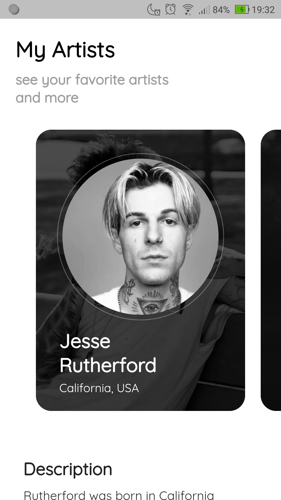
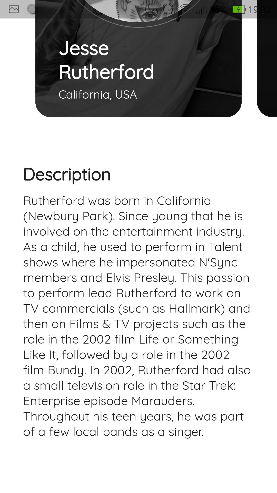
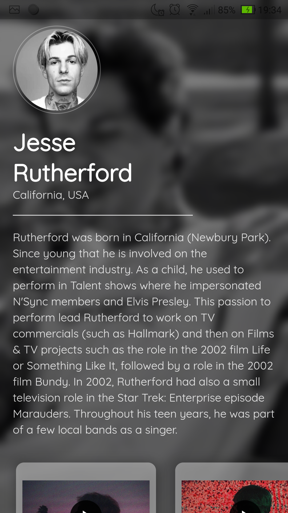
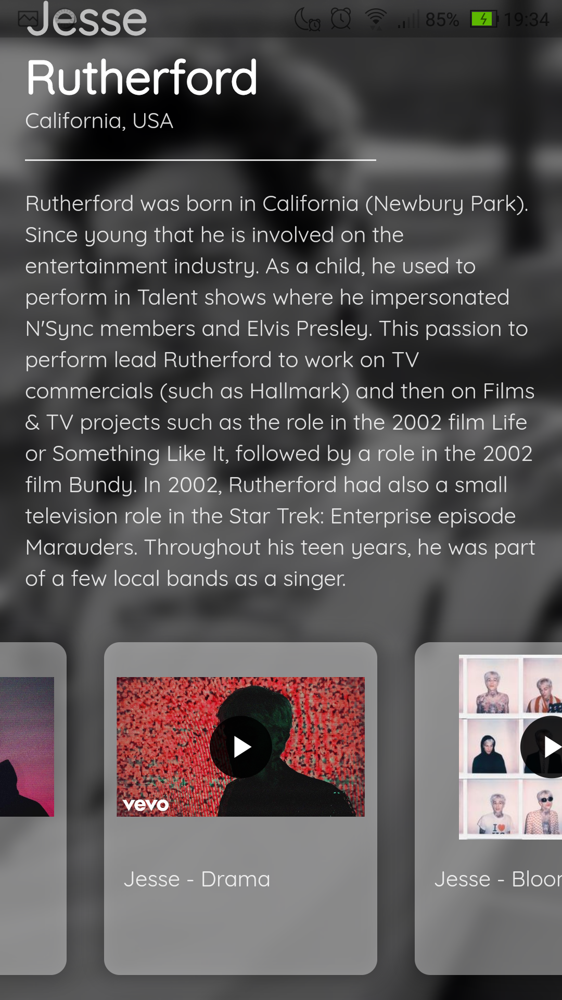
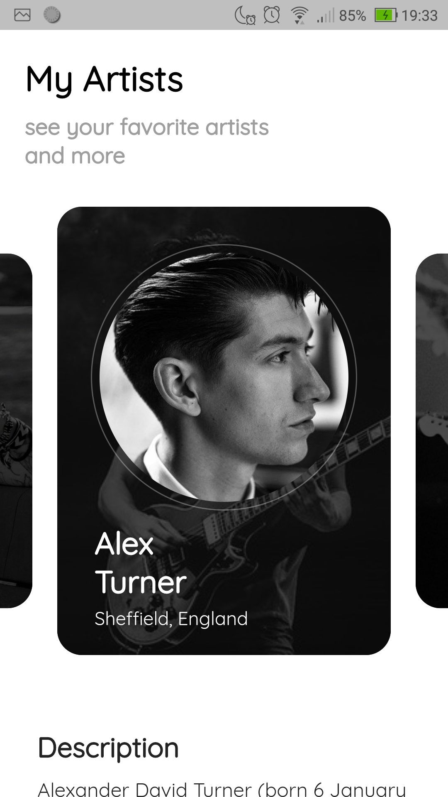
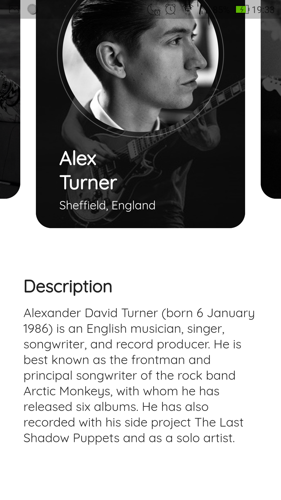
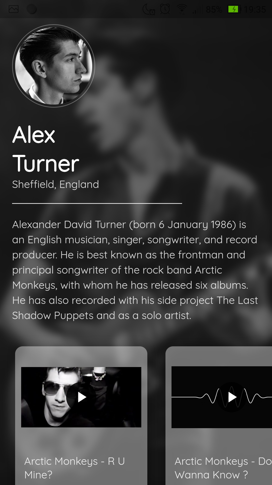
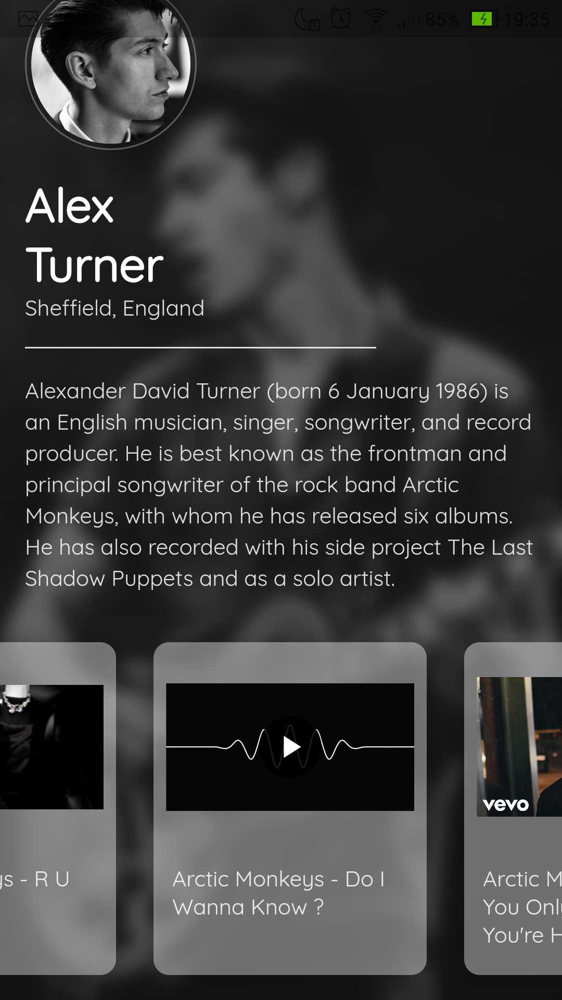
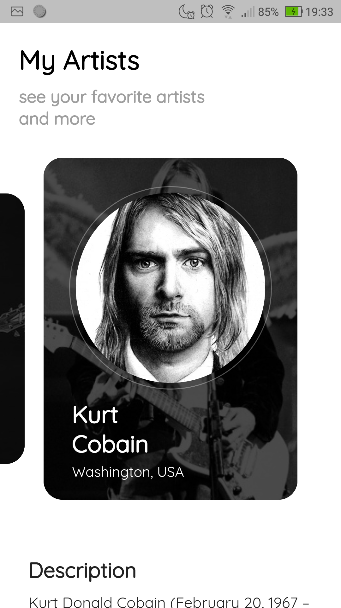
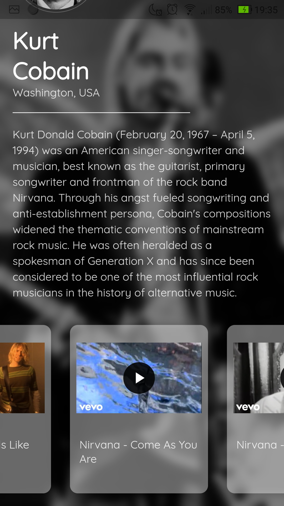

# Flutter-MyArtists
💻💻 MyArtists is a app to check information, photos, videos and a track record of your favorite music artists

***

## Development

To run this project on your own, do the following: 
1. Clone this project.
2. Access the path `Flutter-MyArtists/my_artists`.
3. Run `flutter pub get`.
4. Run the project using `flutter run` or using your IDE's tools.
***

## Screenshots
|     |     |     |     |
| :-: | :-: | :-: | :-: |
| Home Page | Home Page | Details Page | Details Page |
|  |  |  | |
| Home Page | Home Page | Details Page | Details Page |
|  |  |  | |
| Home Page | Home Page | Details Page | Details Page |
|  |  |  | |

